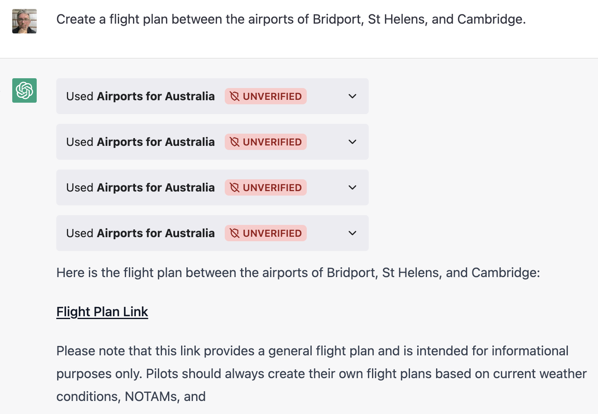
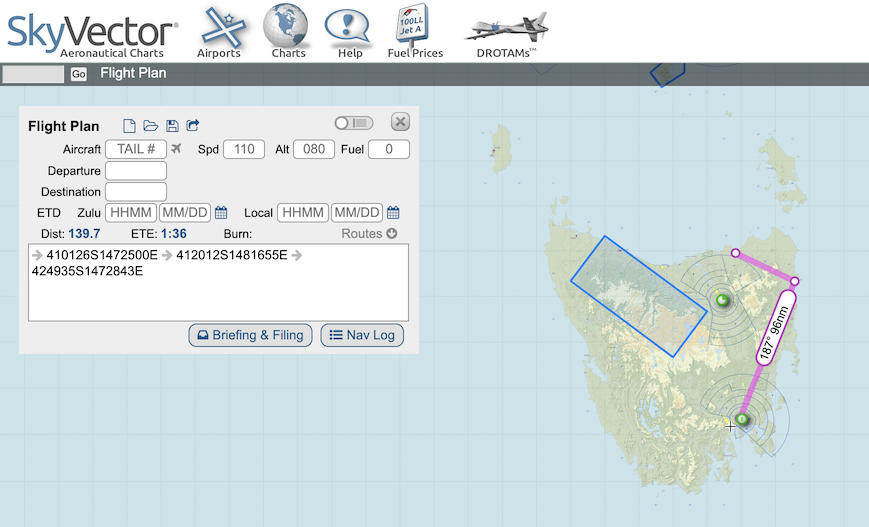
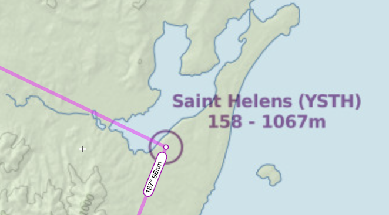
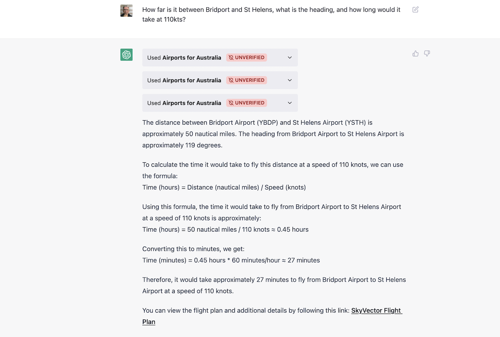
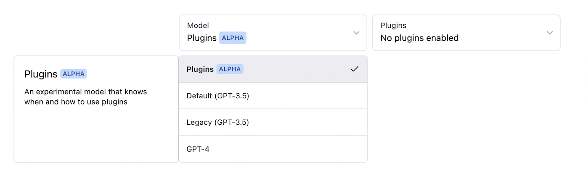

# ChatGPT plugin in Ruby - Airport information

ChatGPT plugin that returns airport information in Australia, written in Ruby/Sinatra.

Airport information was downloaded from <https://ourairports.com/countries/AU/> and is stored in `data/au-airports.csv`.

## Example usage

Ask for a flight plan between some town airports.





It correctly uses the town's local airport GPS coordinates, not the towns' themselves.



You can also ask for heading and time to fly, which ChatGPT can help do the calculation.



## Run locally and test on ChatGPT

To start up the application and bind to port 9292:

```plain
bundle
rerun rackup
```

You will need to expose the application to the internet. I use <https://ngrok.com/>.

```plain
ngrok http --region=au 9292
```

The output shows you your domain

```plain
Session Status                online
Region                        Australia (au)
Forwarding                    https://e92baeb18b8a.ngrok.app -> http://localhost:9292
```

The domain `e92baeb18b8a.ngrok.app` will be passed to ChatGPT when we register the plugin.

## Register plugin with ChatGPT

Open <https://chat.openai.com/chat>, and switch to the ChatGPT "Plugins" model.



Next, under the Plugins dropdown, select "Plugin Store".


At the bottom of the modal, click on **"Develop your own plugin"**.

Click the green **"My manifest is ready"** button.

Copy your ngrok domain `e92baeb18b8a.ngrok.app` into the form, and click the green "Find manifest file" button.

ChatGPT will validate the two manifest files. Click the green **Next** button.

Next, click **Install for me**, then **Continue**, then **Install plugin**.
